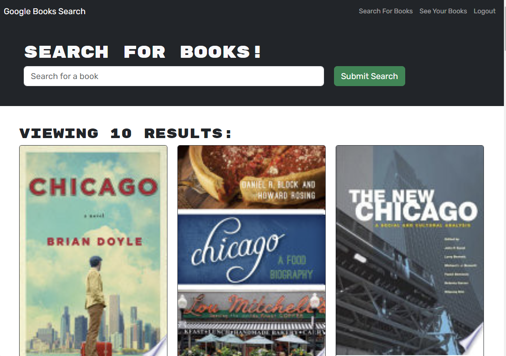
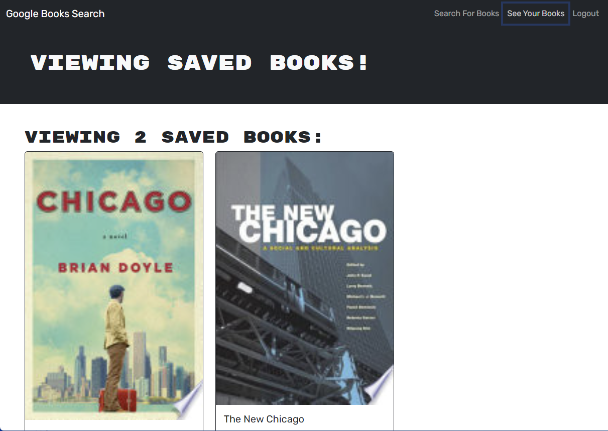

# Qraphql-Refactor

## Description

###
This project was a refactoring of a website from restful-api to graphql. This website is a simple website that allows you to create a user account. Search for books and if you are logged in you can save your books to a favorites page.

## Links

- [Live](https://shielded-temple-63390-b6fc41f9fbc4.herokuapp.com/)
- [Repo](https://github.com/KDonnelly33/graphql-refactor)

## Screenshots

